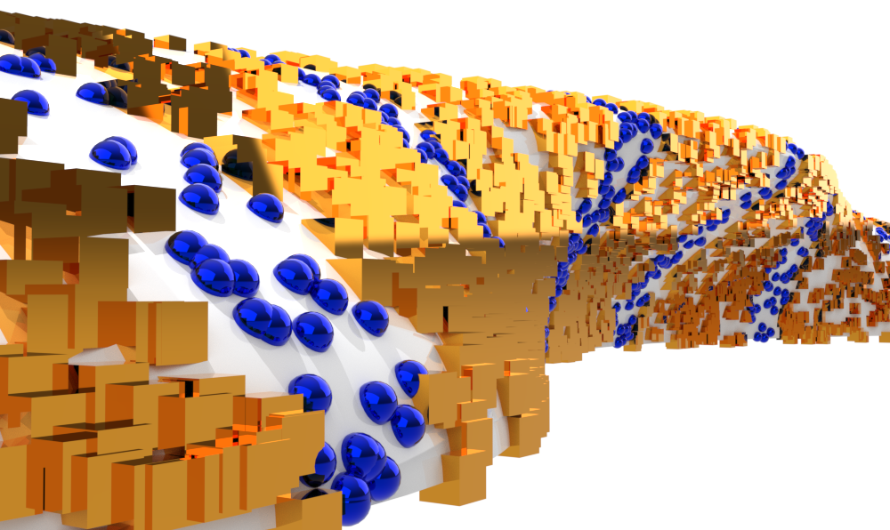

# point-cloud-to-sac
- C++ header-only library
- Given a solid as a point-cloud, calculate it's sectional area
# Dependencies
- Standard Library
# Current Capabilities
## `SectionalAreaXwiseYsymmetrical()`
 The given point cloud must lie on the bounding surface of the underlying solid. Further, the solid must align with certain assumptions: 
 - must be symmetrical with respect to the XZ plane ${\bf P}(u,v) = (u,0,v)$ and all points in the point cloud must be in the same side of $\bf P$
- it does not have to be convex, but it must be star-convex with respect to ${\bf P}$ in the sense that for every point ${\bf p}=(p_1,p_2,p_3)$ on the point cloud, the line between ${\bf p}$ and $(p_1,0,p_3)$ must be contained inside the solid

# Usage

After creating a directory in your project `foo`, copy the following files from `src`
- `point-cloud-to-sac.hpp`
- `on-surface-point-cloud-to-sac.hpp`
- `on-surface-point-cloud-to-sac-utils.hpp`

Then, in your script `#include "foo/point-cloud-to-sac.hpp"`. The point cloud must be provided as a `std::vector<std::vector<double>> pnts` where `pnts.at(i)` refers to the $i^{th}$ point.

See `doc/documentation.pdf` and `tests/test-1.cpp`, `tests/test-3.cpp` for two examples: the former is on a solid for which we know the exact sectional area, while the latter for one which we do not.

# Future

- Add option to import point cloud as file
- Access point cloud by reference
- Accept general point cloud list
- Implement `SectionalAreaXwiseYsymmetrical()`  without the assumptions for the underlying solid: (1) Y-symmetry can be easily discarded (2) star-convexity can be discarded by orienting the parallelograms and establishing some order in the contour of the points (i.e. based on their distance?)
- Implement `SectionalAreaXwiseYsymmetrical()` without the point-cloud having to lie on the bounding surface.